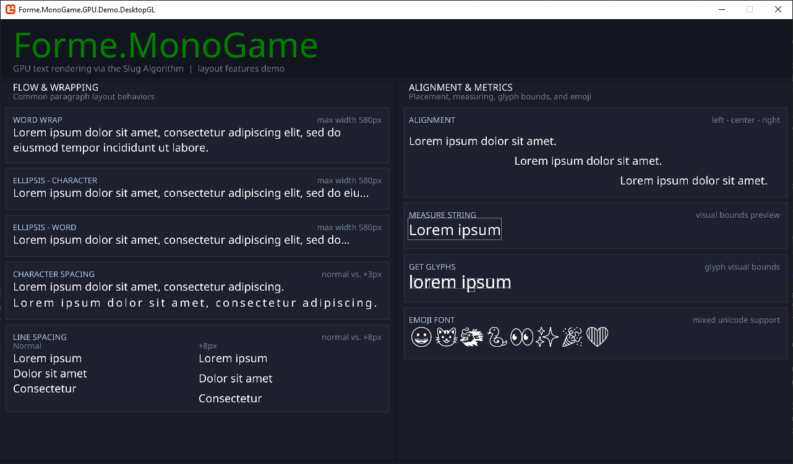

# Forme



Forme renders text directly from quadratic Bezier glyph outline data on the GPU without precomputed textures, distance fields, or rasterized atlases. At any size and any scale, text remains sharp. Forme also provides a CPU rasterization path that produces standard MonoGame `SpriteFont` objects for cases where traditional bitmap fonts are preferred.

## Why the name Forme

According to the Slug creator:

> The name Slug comes from the history of typography. A full line of text cast as one piece of hot lead by a Linotype machine was called a slug. The primary function of our software is to lay out and render lines of text.

So to follow in this spirit of naming, Forme was chosen because in traditional letterpress printing, a forme is the complete assembly of individual pieces of type, letters, spacing, and lines, locked together into a single unit, ready for printing.

Where a slug represents a single cast line of text, a forme represents the next step: the composition of many lines into a structured, finalized layout.

## Libraries

The repository is split across three libraries and a content pipeline extension.

### Forme

**Forme** is the core font processing library with no dependency on MonoGame or any graphics framework. It reads TrueType and OpenType font files, extracts glyph outlines, builds the curve and band textures required by the Slug algorithm, and handles text layout including word wrapping, alignment, and ellipsis truncation. It can save and load processed font data to a `.forme` binary file so that the TTF does not need to be reprocessed on every launch.

### Forme.MonoGame

**Forme.MonoGame** is the MonoGame-specific rendering layer. It uploads curve and band texture data to the GPU, manages the compiled Slug shaders (one for OpenGL, one for DirectX 11, both embedded in the assembly and selected automatically at runtime), and exposes `FormeRenderer` for GPU-accelerated text rendering. It also exposes `FormeSpriteFont` for creating standard `SpriteFont` objects from TTF data at runtime.

### Forme.MonoGame.Content.Pipeline

**Forme.MonoGame.Content.Pipeline** is the MGCB content pipeline extension. It adds importers and processors for TTF and `.forme` files so that fonts can be compiled as content and loaded through the standard `Content.Load<FormeFont>()` API.

## Installation

Install via NuGet.

```
dotnet add package AristurtleDev.Forme
dotnet add package AristurtleDev.Forme.MonoGame
```

To use the content pipeline extension with MonoGame, add the reference the following NuGet package in your project and add the dll reference to your Content.mgcb file as usual.

```
dotnet add package AristurtleDev.Forme.MonoGame.Content.Pipeline
```

## Usage

### Loading a Font

Load from a TTF file at runtime:

```csharp
using Forme;

byte[] ttfData = File.ReadAllBytes("NotoSans-Regular.ttf");
FormeFont font = FormeFont.FromTtf(ttfData, CharacterSet.Ascii);
```

Save the processed font data to a `.forme` file to avoid reprocessing:

```csharp
font.Save("NotoSans-Regular.forme");
```

Load from a previously saved `.forme` file:

```csharp
FormeFont font = FormeFont.FromFile("NotoSans-Regular.forme");
```

Load via the MonoGame content pipeline (requires Forme.MonoGame.Content.Pipeline):

```csharp
FormeFont font = Content.Load<FormeFont>("NotoSans-Regular");
```

### GPU Rendering

Upload the font to the GPU, then use `FormeRenderer` to draw:

```csharp
using Forme.MonoGame;

FormeFontDevice fontDevice = new FormeFontDevice(GraphicsDevice, font);
FormeRenderer renderer = new FormeRenderer(GraphicsDevice);

// In Draw():
renderer.Begin();
renderer.DrawString(fontDevice, "Hello, world!", new Vector2(100, 100), Color.White, sizePixels: 32);
renderer.End();
```

### Text Layout

Measure logical layout bounds before drawing:

```csharp
FormeTextBounds logicalBounds = font.MeasureLogicalBounds("Hello, world!", sizePixels: 32);
FormeTextBounds visualBounds = font.MeasureVisualBounds("Hello, world!", sizePixels: 32);
```

Use `TextLayoutOptions` for word wrapping, alignment, and ellipsis:

```csharp
TextLayoutOptions options = new TextLayoutOptions
{
    MaxWidth = 400,
    Alignment = TextHorizontalAlignment.Center,
    EllipsisMode = EllipsisMode.Word
};

FormeTextBounds bounds = font.MeasureLogicalBounds("Hello, world!", sizePixels: 32, options);
IReadOnlyList<GlyphPlacement> glyphs = font.GetGlyphs("Hello, world!", sizePixels: 32, options);
```

Query baseline-relative font metrics in pixel space:

```csharp
ScaledFontMetrics metrics = font.GetScaledMetrics(sizePixels: 32);
float lineHeight = metrics.LineHeight;
float baselineToTop = metrics.BaselineToTop;
float baselineToBottom = metrics.BaselineToBottom;
```

### SpriteFont (CPU Rasterization)

Create a standard MonoGame `SpriteFont` from TTF data at runtime:

```csharp
using Forme.MonoGame;

byte[] ttfData = File.ReadAllBytes("NotoSans-Regular.ttf");
SpriteFont spriteFont = FormeSpriteFont.Create(GraphicsDevice, ttfData, sizePixels: 24, CharacterSet.Ascii);

// Use with SpriteBatch as normal:
spriteBatch.DrawString(spriteFont, "Hello, world!", new Vector2(100, 100), Color.White);
```

## Demos

### GPU Rendering Demo

Located in [`demo/GPURenderingDemo`](./demo/GPURenderingDemo/). Demonstrates GPU accelerated text rendering using the Slug algorithm. Both a DesktopGL and a WindowsDX project are included. The DesktopGL project loads fonts through the content pipeline. The WindowsDX project loads fonts at runtime via `FormeFont.FromTtf()`.

The demo shows text at multiple sizes, word-wrapped and aligned text, character and line spacing, all three ellipsis modes, and optional visual overlays for bounding boxes and baselines.

### SpriteFont Rendering Demo

Located in [`demo/SpriteFontRenderingDemo`](./demo/SpriteFontRenderingDemo/). Demonstrates creating MonoGame `SpriteFont` objects from TTF data using `FormeSpriteFont.Create()`. Both a DesktopGL and a WindowsDX project are included. The demo shows fonts at multiple sizes rendered through the standard `SpriteBatch` API.

## Shader Implementation Notes

The Slug reference shaders are written for DirectX with full Shader Model 5 features available. MonoGame's OpenGL backend compiles HLSL to GLSL via [MojoShader](https://icculus.org/mojoshader/), which only supports Shader Model 3. SM3 has no integer arithmetic, no integer textures, no integer loop variables, and no direct texel load instructions. The Forme shader targets SM3 for OpenGL and SM4 for DirectX 11 from a single `.fx` source file, gating the profile with `#if OPENGL` preprocessor blocks.

The following describes what had to change from the reference and why.

### No integer bitwise operations.

The reference `CalcRootCode()` determines which roots of a quadratic contribute to coverage by extracting the signs of three y-coordinates via `asuint()` and a packed bit lookup table (`0x2E74U >> shift`). SM3 has no integer instructions at all, including `asuint`. Forme replaces this with `CalcRootEligibility()`, which computes the same sign-combination logic using float comparisons (`> 0.0`), multiplies, and `saturate`. The result is semantically identical but expressed entirely in floating-point arithmetic.

### No integer textures.

The reference band texture is typed `Texture2D<uint4>` and read with `.Load(int3(x, y, 0))`, which requires SM4. MojoShader cannot express typed integer textures or direct texel loads at SM3. The band texture is instead formatted as `RG32F`, storing unsigned 16-bit integers packed as floats. All texture reads use `tex2Dlod` with computed UV coordinates of the form `(float2(tx, ty) + 0.5) / texSize` rather than direct integer pixel coordinates. This requires helper functions (`FetchBandTexel`, `FetchCurveTexel`) that convert a flat linear texel index into a 2D UV before sampling.

### No integer band addressing.

The reference `CalcBandLoc()` wraps a linear texel offset back to a 2D coordinate using right-shift and bitwise AND, both integer-only operations. Forme uses `fmod()` and `floor()` instead to perform the same wrap-around arithmetic in float.

### No integer loop counters.

SM3 does not support `for` loops with integer counters when integer instructions are absent. Forme uses a `float` loop variable with the `[loop]` hint and `+= 1.0` increments.

### Vertex data packed differently.

The reference vertex shader unpacks band texture coordinates from a 32-bit integer stored in `tex.z` via `asuint()` and bit shifts. Without integer casting, this is not possible in SM3. Forme instead stores the band texture X and Y coordinates as a single packed float (y * textureWidth + x) passed through `tex.z`, and unpacks them with `fmod` and `floor` in the pixel shader, where `bandTexSize` is available.

### Dynamic dilation adapted for orthographic projection.

The reference vertex shader applies sub-pixel outward dilation (Lengyel 2017, Section 4) by pushing each vertex 0.5 screen pixels outward along its corner normal and adjusting the em-space sample coordinate by the same amount using the inverse Jacobian. The reference computes the inverse Jacobian from the perspective projection matrix, which does not apply to orthographic rendering.

Forme computes the inverse Jacobian per glyph on the CPU from the ratio of the glyph's em-space bounding box dimensions to its screen-space pixel dimensions (`invJxx = (ex1 - ex0) / (px1 - px0)`, `invJyy = (ey0 - ey1) / (py1 - py0)`). These values are constant across all four vertices of a glyph quad, so they are packed into the vertex stream alongside the band LUT UV in TEXCOORD2.

Because TEXCOORD2 was previously used to pass the per-glyph band transform (four floats) directly through the vertex stream, and SM3 provides only four vertex attribute slots, the band transform is instead stored in a per-font RGBA32F LUT texture (`FormeFontDevice.BandLutTexture`). The pixel shader fetches it using the LUT UV passed through TEXCOORD2, freeing two floats in that slot for the inverse Jacobian values.

### Near-linear epsilon widened.

The reference `SolveHorizPoly()` falls back to a linear solve when the quadratic coefficient `a.y` is smaller than `1.0 / 65536.0`. This threshold is too tight for GLSL produced by MojoShader. Curves with `a.y` slightly above that threshold caused near-division-by-zero, producing extreme t values and horizontal banding artifacts. The epsilon is widened to `0.0001`, which eliminates the artifacts without affecting any visible curve.

### Vertical pass unified with horizontal pass.

The reference has separate `SolveHorizPoly` and `SolveVertPoly` functions. Forme eliminates `SolveVertPoly` by swapping the x and y components of the control points before passing them to `SolveHorizPoly`, reducing code duplication.

## Third-Party Credits

### Slug Algorithm

[**Slug Algorithm**](https://github.com/EricLengyel/Slug) by Eric Lengyel (Terathon Software). GPU antialiased text rendering from quadratic Bezier glyph outlines. Published in the [Journal of Computer Graphics Techniques, Vol. 6, No. 2, 2017](https://jcgt.org/published/0006/02/02/).

[Now in the public domain](https://terathon.com/blog/decade-slug.html) as of Match 17, 2026, licensed under MIT or Apache. Forme is an independent implementation of this algorithm; Terathon Software is not affiliated with this project.

For license detail on Slug, please see the [THIRD_PARTY_NOTICES](THIRD_PARTY_NOTICES).

### StbTrueTypeSharp

[**StbTrueTypeSharp**](https://github.com/StbSharp/StbTrueTypeSharp) by the StbSharp project maintained by [Roman Shapiro](https://github.com/rds1983). C# port of Sean Barrett's stb_truetype.h for reading and parsing TrueType and OpenType font files. Used by the core Forme library to extract glyph metrics and outlines.

## License

Forme is licensed under the MIT License. See [LICENSE](LICENSE) for the full license text.
